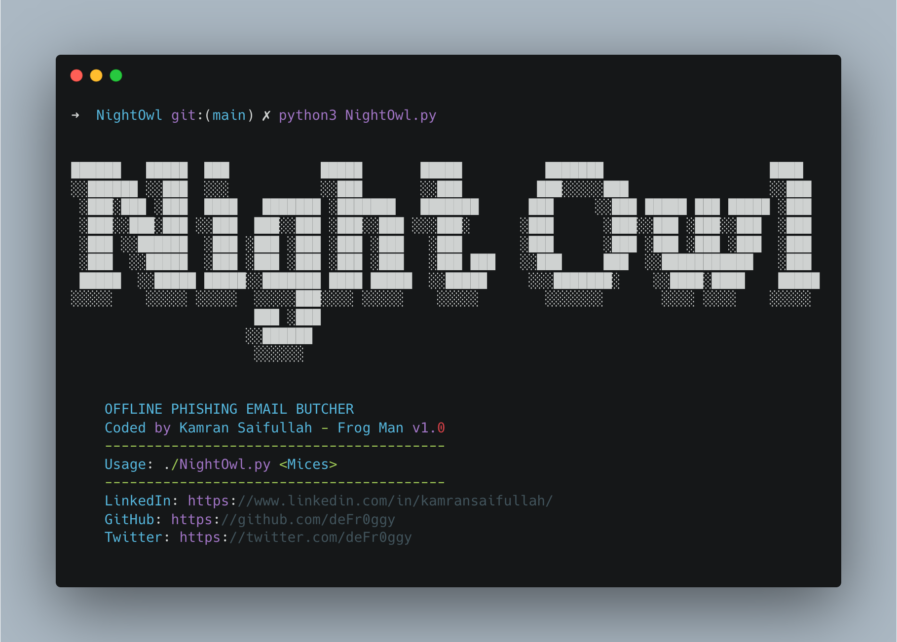

```
██████   █████  ███           █████       █████          ███████                    ████ 
░░██████ ░░███  ░░░           ░░███       ░░███         ███░░░░░███                 ░░███ 
 ░███░███ ░███  ████   ███████ ░███████   ███████      ███     ░░███ █████ ███ █████ ░███ 
 ░███░░███░███ ░░███  ███░░███ ░███░░███ ░░░███░      ░███      ░███░░███ ░███░░███  ░███ 
 ░███ ░░██████  ░███ ░███ ░███ ░███ ░███   ░███       ░███      ░███ ░███ ░███ ░███  ░███ 
 ░███  ░░█████  ░███ ░███ ░███ ░███ ░███   ░███ ███   ░░███     ███  ░░███████████   ░███ 
 █████  ░░█████ █████░░███████ ████ █████  ░░█████     ░░░███████░    ░░████░████    █████
░░░░░    ░░░░░ ░░░░░  ░░░░░███░░░░ ░░░░░    ░░░░░        ░░░░░░░       ░░░░ ░░░░    ░░░░░ 
                      ███ ░███                                                            
                     ░░██████                                                             
                      ░░░░░░                                                              
 ```


<h4 align="center">Python script to butcher Email Headers</h4>

Every organization receives SPAM, Phishing and Spear Phishing Emails. Whenever such emails are received the first and the foremost actions required is to get the Email Headers, Attachments, Email Addresses, Embedded URLs which are then shared either with the MSSP currently looking after your security or with the internal Security Analysts. 

The reason is to find all the required information i.e. to perform end-to-end Email Forensics in order to find answers like. 

- Who sent the email?
- From where it originated?
- How many people have received the email?
- Does the email contained a phishing link or it contained only plain text?
- Does the email contains any attachments?

These are only few of the questions which always come to our mind when we consider these scenarios. Keeping these details in mind I have developed **Night Owl** to automate the manual procedure to find all possible answers to our questions. 

---

**Night Owl** is a quick and dirty python script to perform analysis on Email Headers. The script renders all the required information for you to take quick actions rather than going through the headers line by line. **The script does it for you** automatically.

I have developed this script during my day job and I do plan to take it one step further with time. 

## Supported Email Extensions

Currently the script is able to scrape the data from the following extensions only. 

- **.msg**
- **.eml**

Later on support and functionality will be added for other email formats. 

## Dependencies

The requirements for the program are as below. Please ensure to have the following dependencies installed on your local system.

```
1. Python3
2. Colorama
3. Requests
4. Re
5. Os
6. Sys
7. Json
8. Socket
9. Extract MSG
10. Email
```

## Usage



## Butchering Details From Emails

These headers include the following.
- FROM
- TO 
- SUBJECT
- DATE
- CC
- BCC
- Attachments

## Hops Count

The script counts for the total number of hops (MTAs/MDAs). Thusm we can calculate the total number of MTAs/MDAs involved since the email generation to its landing in our inbox.

## Butchering IP Addresses

The script then looks for all the IP addresses from the Email Headers and lists them down for analysis. These are the IP addresses which are of MTAs/MDAs, Receivers and any other IP addresses embedded within the email or elsewhere. It hunts for all.

## Butchering Email Addresses

The script looks for all the available email addresses from within the Email Headers and lists them down. This is to check which mail servers, senders, receivers are involved. 

## Butchering URLs

The script also looks for all the available URLs from the email headers and provides us with the information to take quick actions i.e. to get these URLs blocked on Email Gateways, Firewalls etc to prevent infections proactively.

## Butchering HTML Embedded Contents

The script hunts down all the HTML contents if it is present in the Email Headers. It alerts that there is an HTML content present in the email and asks for the output file where it can write that data to for later analysis.

## Butchering Email Attachments
The script is now able to find the attachments in the email (all types) and to have them saved in the current working directory of the script for later investigations.

## Listing Down All X-* Headers

These headers provide a wide range of information. Also, these headers gets added to the Email as soon as the email starts to propogate. These can provides us with the information whether the email is a SPAM, Malicious, routed through MS-Exchange etc. Close attention is required for these headers.

---
